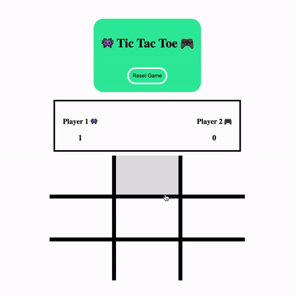

# Tic Tac Toe Game

A classic Tic Tac Toe game built with HTML, CSS, and JavaScript. This game allows two players to compete in a turn-based strategy game, aiming to align three of their symbols vertically, horizontally, or diagonally while preventing their opponent from doing the same.

## Demo

See the Tic Tac Toe game in action:



## Features

- Interactive Tic Tac Toe board
- Score tracking for two players
- Game reset functionality
- Confetti animation for the winning player

## Prerequisites

Before you begin, ensure you have met the following requirements:

- A modern web browser that supports HTML5, CSS3, and JavaScript ES6.

## Installation

To install Tic Tac Toe, follow these steps:

1. Clone the repository to your local machine:

```bash
git clone https://github.com/mojoee/tictactoe.git
```

2. Open the `index.html` file in your web browser.

## Usage

To play Tic Tac Toe, follow these steps:

1. Open the game in a web browser.
2. Player 1 starts the game with the symbol 👾, and Player 2 follows with the symbol 🎮.
3. Click on a cell in the Tic Tac Toe board to place your symbol.
4. The first player to align three symbols vertically, horizontally, or diagonally wins.
5. Press the "Reset Game" button to start a new game at any time.
6. The score for each player is displayed above the game board.

## Contributing

Contributions to the Tic Tac Toe game are welcome. To contribute:

1. Fork the repository.
2. Create a new branch (`git checkout -b feature/AmazingFeature`).
3. Make your changes.
4. Commit your changes (`git commit -m 'Add some AmazingFeature'`).
5. Push to the branch (`git push origin feature/AmazingFeature`).
6. Open a pull request.

## License

This project is licensed under the MIT License - see the LICENSE.md file for details.

## Contact

If you have any questions or feedback, please contact me via my [homepage](moritzsontheimer.cool).

## Acknowledgements

- Canvas Confetti for the confetti animation: [https://www.kirilv.com/canvas-confetti/](https://www.kirilv.com/canvas-confetti/)
- Emoji symbols are used for player icons.
